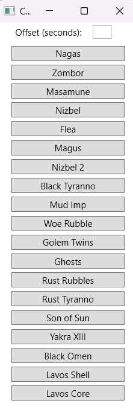

# Chrono Trigger PC Manip Tool
This tool assists with system time configuration for Chrono Trigger PC / Steam.\
**Windows only** - Windows versions older than Windows 10 are untested and unsupported.

### Warning: Altering system time may cause severe issues, including data loss, software malfunction, network problems, and instability.
### I do not assume responsibility for any resulting damage.
**Proceed with caution.**

## Usage:
**UAC (User Account Control) MUST BE DISABLED**
This is due to the required admin privileges in configuring date and time.
If you run into issues, you will lose internet access - see Troubleshooting below.

Download the latest release from the [Releases page](https://github.com/valheru7/CTManip/releases) \
.NET 7 or higher required. You should be prompted to download it automatically if you don't already have it.

1. Have Chrono Trigger on a save or autosave you want to manipulate
2. ALT-F4 / Close the game
3. Click the manip you want to use on this tool
4. Open Chrono Trigger and load your save (or Resume bookmark)

System time and date should be set when clicking the button.\
System time and date should automatically revert when the game is launched.

**Troubleshooting:**
* Loss of internet access:
 Open CMD as administrator and run "w32tm /resync"
* If time is not being resynced automatically, try registering w32tm:\
 Open CMD as administrator and run "w32tm /register"
* Wrong timezone after closing the program:
 Right-click system time -> Adjust Date & Time -> Change Time zone

**Attributions**
Based on the wonderous work from [F34Manip](https://github.com/Ricky-James/FF34Manip) 